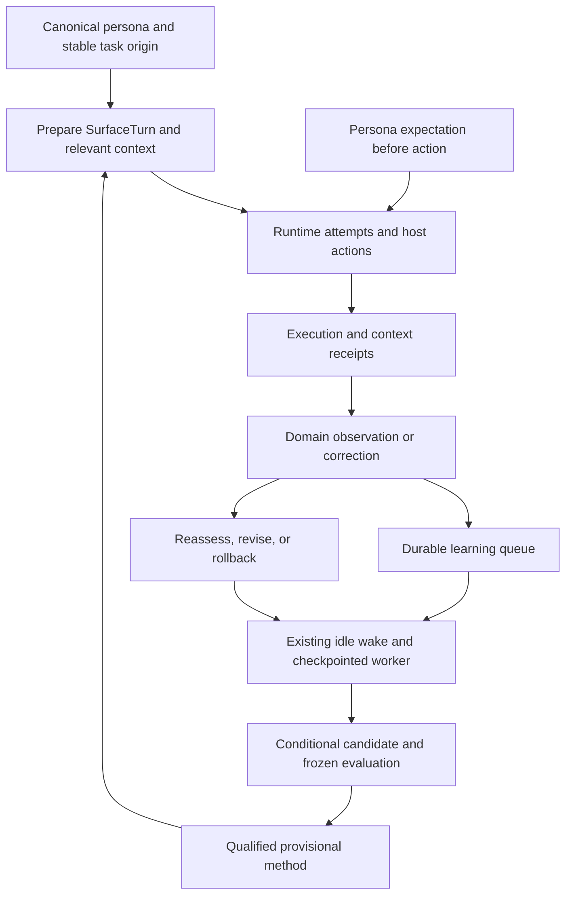

# Extend Persona Harness Learning

Introduced in v1.8.0. This guide covers framework integration; see the
[operator guide](persona-harness-learning.md) for inspection, pause, and rollback.

## Lifecycle And Ownership

The Python harness owns persistent learning. A surface captures what crossed its
host boundary; a domain producer supplies evidence of what happened afterward.
Provider-specific hooks may adapt these boundaries, but must not own a separate
learning ledger or qualification policy.



## Connect a runtime surface

Use `get_learning_service(persona_id)` or `LearningService.for_persona(persona_id)`
in production. They resolve the explicit physical profile through the canonical
persona helpers. Python uses `default`; the existing dashboard boundary translates
`main`. Do not construct production paths from an ambient profile, caller-supplied
filesystem path, or a record ID. Explicit `LearningTarget` objects below isolate
examples from installed profiles.

After assembling and clamping the existing prompt, call `prepare_turn_async()`
(`prepare_turn()` for synchronous hosts). It returns a `SurfaceTurn` containing
the request to execute. Pass **`turn.request`** through
`runtime.lane_router.run_with_runtime_lanes()`, then use
`await turn.acomplete(result)` before publishing its returned text. On exceptions,
including cancellation, call `await turn.afailed(exc)` and re-raise. Synchronous
completion and failure methods are `complete()` and `failed()`.

- Keep `origin_id` stable across delivery retries, approval resumes, and provider
  fallback. Chat adapters use `incoming_origin(incoming, session_key)` and
  `canonical_turn_id()`; text or a fresh retry UUID is not a logical task ID.
- Each runtime attempt gets its own ID and actual provider/model metadata from
  the canonical runtime's `attempt_observer`. Preserve this callback. A host retry
  can use `aretry_request()` while retaining the experience; fallback remains the
  runtime's responsibility.
- Tool-capable surfaces keep the scoped registry definitions and dispatch.
  Preparation wraps host dispatch without granting tools. The persona calls the
  registered `record_expectation` before a meaningful write or execution. Read
  tools do not consume that expectation. Existing action approval still applies.
- A tool-less recommendation can append the expectation envelope shown below.
  The host records it before publication, not before drafting. Ordinary
  conversation does not need an invented prediction.
- Host dispatch and final output are observable. Provider-owned internal shell,
  browser, or reasoning steps without host callbacks remain explicitly uncaptured.
  `require_capture=True` makes capture failures fatal for a controlled experiment;
  ordinary surfaces expose coverage failures and continue.
- `complete()` records a generated artifact with `publication_confirmed=False`.
  A downstream publisher must provide its own verified execution or observation
  receipt; generated text does not establish delivery or a domain outcome.

The trailing envelope is `<<LEARNING_EXPECTATION: {"claim":"Testable prediction",
"check_by":"2030-01-01T00:00:00+00:00","resolution_rule":"Observable resolution rule",
"situation":{"context":"Point-in-time situation"}}>>`. Set `check_by` to the
actual future, timezone-aware observation deadline; the date above is illustrative.
The four fields are required. `SurfaceTurn.complete()` strips this marker from
published text and supplies `phase="pre_publication"` and `author="persona"`.

Context receipts use three phases: `prepared`, `submitted`, and `executed`.
Only an executed receipt containing a selected method has status `delivered`.
Receipts compare the exact outgoing prompt with selected content; merely selecting
a method, preparing a request, or starting a failed attempt cannot prove its use.
The normal runtime callback records submission, and completion records execution
with `RuntimeResult.model` and `.provider`. Hosts that need an earlier prepared
receipt can call `record_context_receipt(..., phase="prepared")` explicitly.

### Runnable surface smoke

Run each Python block as a complete script from `.claude/scripts` using the
repository's Python environment. The examples create and remove a temporary
directory beneath that working directory. Their temporary learning flags override
only the example process. No installed profile, worker, account, or model is used.

This fake runtime emits the same attempt events as the real router. It verifies
the integration shape, not provider behavior or improved performance. With no
qualified methods in the temporary profile, context receipts correctly stay empty.

```python
import asyncio
from pathlib import Path
from tempfile import TemporaryDirectory
from unittest.mock import patch

from personas.learning.hooks import prepare_turn_async
from personas.learning.models import LearningTarget
from personas.learning.service import LearningService
from runtime.base import RuntimeRequest, RuntimeResult


async def fake_runtime(request):
    event = {
        "attempt_id": "fake-attempt-1", "runtime_lane": "generic_runtime",
        "provider": "fixture", "model": "fixture-v1",
    }
    await request.attempt_observer({**event, "phase": "started"})
    result = RuntimeResult(
        text="Ask which deliverable matters most.",
        runtime_lane="generic_runtime", provider="fixture", model="fixture-v1",
    )
    await request.attempt_observer({**event, "phase": "succeeded"})
    return result


async def main():
    flags = {
        "PERSONA_LEARNING_ENABLED": "true",
        "HOMIE_KILLSWITCH_HARNESS_LEARNING": "enabled",
    }
    with TemporaryDirectory(prefix="learning-doc-", dir=".") as directory:
        root = Path(directory).absolute()
        service = LearningService(LearningTarget(
            persona_id="docs-demo", memory_dir=root / "memory",
            data_dir=root / "data", state_dir=root / "state",
            skills_dir=root / "skills",
        ))
        with patch.dict("os.environ", flags):
            turn = await prepare_turn_async(
                RuntimeRequest(
                    prompt="A prospect questions price. Suggest a diagnostic question.",
                    cwd=root, task_name="documentation-smoke", model="fixture-v1",
                    model_only=True, allowed_tools=[], disallowed_tools=["*"],
                ),
                persona_id="docs-demo", surface="documentation",
                origin_id="fixture:conversation-1:turn-1", service=service,
                require_capture=True,
            )
            service.record_context_receipt(
                turn.experience["id"], turn.context, turn.request.prompt,
                attempt_key="fake-prepared", phase="prepared",
            )
            try:
                result = await fake_runtime(turn.request)
                text = await turn.acomplete(result)
            except BaseException as exc:
                await turn.afailed(exc)
                raise
            contexts = service.list_records("context")["items"]
            assert {r["phase"] for r in contexts} == {
                "prepared", "submitted", "executed",
            }
            assert all(r["status"] == "empty" for r in contexts)
            executed = next(r for r in contexts if r["phase"] == "executed")
            assert (executed["provider"], executed["model"]) == ("fixture", "fixture-v1")
            assert not turn.failures
            assert text == result.text
            print("Surface capture and context phases verified; no methods activated.")


asyncio.run(main())
```

For production, replace the temporary target with the canonical resolver and the
fake call with `run_with_runtime_lanes(turn.request)`. Retain the surface's existing
runtime selection, scoped tools, authorization, and publication handling.

## Connect a domain evidence producer

A producer calls `capture_experience()`, commits the persona's expectation before
the action, records execution, and later calls `record_observation()` with the
same experience/expectation IDs. Use immutable source IDs plus revision IDs for
idempotency. Replaying identical content under the same key returns the same
record; changing content requires a new key. Credentials never belong in evidence.

Use `mode="backfill"` and `phase="retrospective"` for historical material. Study
sources must distinguish literal source evidence from model-generated synthesis.
Practice/evaluation output must not masquerade as real outcomes. Preserve the
source's timestamp, identity, captured bytes or verifiable receipt, and uncertainty.
An execution's success alone does not establish that its expectation held.

The next example simulates a local diagnostic action and a corrected result. It
uses real persistence APIs, without inventing an evaluator receipt or activating
a method. Both observations are synthetic fixtures confined to temporary storage.

```python
from datetime import UTC, datetime, timedelta
from pathlib import Path
from tempfile import TemporaryDirectory
from unittest.mock import patch

from personas.learning.models import LearningTarget
from personas.learning.service import LearningService

flags = {
    "PERSONA_LEARNING_ENABLED": "true",
    "HOMIE_KILLSWITCH_HARNESS_LEARNING": "enabled",
}
with TemporaryDirectory(prefix="learning-doc-", dir=".") as directory:
    root = Path(directory).absolute()
    service = LearningService(LearningTarget(
        persona_id="docs-demo", memory_dir=root / "memory",
        data_dir=root / "data", state_dir=root / "state", skills_dir=root / "skills",
    ))
    with patch.dict("os.environ", flags):
        experience = service.capture_experience(
            "fixture:job-42", "local-diagnostic", "Check an example document",
            mode="practice", metadata={"synthetic": True},
        )
        expectation = service.commit_expectation(experience["id"], {
            "claim": "The example document contains no broken links.",
            "check_by": (datetime.now(UTC) + timedelta(hours=1)).isoformat(),
            "resolution_rule": "The complete scanner receipt reports zero broken links.",
            "situation": {"document_revision": "fixture-revision-1"},
            "phase": "pre_action", "author": "persona",
        }, action_key="scan-1")
        service.record_execution(experience["id"], {
            "action_key": "scan-1", "expectation_id": expectation["id"],
            "success": True, "artifact": {"scanner_run_id": "fixture-run-1"},
        }, attempt_key="scan-1:attempt-1")
        first = service.record_observation(experience["id"], {
            "expectation_id": expectation["id"], "status": "resolved",
            "quality": "direct", "held": True,
            "evidence": {"source_id": "fixture-run-1", "broken_links": 0},
        }, source_key="fixture-run-1:receipt-v1")
        correction = {
            "expectation_id": expectation["id"], "status": "resolved",
            "quality": "direct", "held": False, "supersedes": first["id"],
            "evidence": {
                "source_id": "fixture-run-1", "broken_links": 2,
                "reason": "The first receipt omitted a scanned page.",
            },
        }
        corrected = service.record_observation(
            experience["id"], correction, source_key="fixture-run-1:receipt-v2",
        )
        replay = service.record_observation(
            experience["id"], correction, source_key="fixture-run-1:receipt-v2",
        )
        assert replay["id"] == corrected["id"]
        assert service.get_record(first["id"])["status"] == "superseded"
        assert len(service.list_records("observation")["items"]) == 2
        assert not service.list_records("activation")["items"]
        print("Expectation, execution, correction, and idempotent replay verified.")
```

For delayed polling, extend the existing `collect_due_observation()` dispatch in
`personas/learning/observers.py` and the domain integration that owns its source.
There is no observer plugin registry to register with. The current dispatcher
understands linked Sales mail outcomes; unknown domains return an explicit
`unresolvable` receipt. Add the new domain branch and tests together, using
`expectation.situation` for stable linkage and read-only collection when possible.
Normalize to `quality`, `status`, `evidence`, and `expectation_id`; use `open` for
pending results, `partial` for incomplete access, and `unresolvable` when the claim
cannot be resolved. Missing evidence must not become `held=False`.

Use `supersedes` only to correct an earlier observation. A reply that arrives
after a truthful no-reply-through-deadline observation is new evidence; preserve
the earlier window. The worker fingerprints polling results to avoid rediscovery.

## Scheduling, qualification, and verification

Persistence notifications enqueue work without calling models or launching a
process. `personas.learning.worker.wake_learning()` drains the current or explicit
profile; `personas.learning.worker.run_pending_profiles()` starts correctly
bootstrapped profile children, including default, from the default profile. Existing heartbeat,
reflection, and dream paths use these seams. Extend them; do not add a parallel
cron or inline evaluator to a foreground turn.
The worker checkpoints stages, shares an install-wide lease, and yields to
foreground activity. Provider infrastructure failures defer work; semantic
failures retain bounded retries. Keep these states visible in operator history.

The worker proposes conditional candidates and freezes actual before/after
context bundles, evidence revisions, and separate qualification cases.
`evaluation.evaluate_candidate()` owns evaluation receipts;
`promotion.promote_candidate()` verifies those receipts and publishes through the
existing amendment/skill ledgers. Confidence, a second model's assertion, or a
handwritten passing record cannot authorize adoption. Methods remain provisional
and are reassessed against later delivered-context outcomes and model changes.

Use `promotion.rollback_activation()` for physical retirement and ledger updates;
changing a status or deleting a skill file is not a complete rollback. Corrections
invalidate bound evidence and schedule reassessment. Pause preserves already
applied skills/amendments; rollback targets a particular method.

For each new integration, test stable identity across retry/fallback, an expectation
before action, failure and cancellation capture, no-tools preservation, actual
provider/model attribution, missing and corrected evidence, and prompt truncation
that drops a selected method. Run the examples above as interface smoke tests;
use the existing harness core, runtime reliability, domain, evaluation, and queue
worker suites for lifecycle regressions. Live provider checks are separate evidence.
